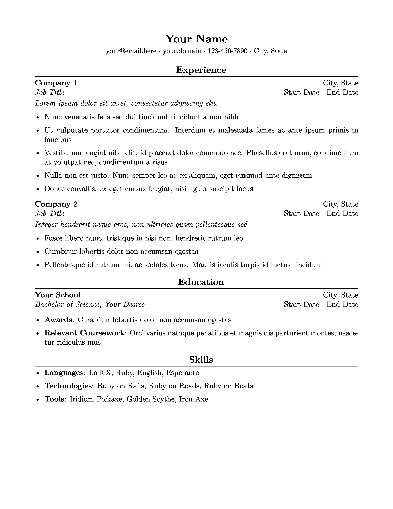

# LaTeX Resume Template

I found that most of the LaTeX resume templates I found online were a bit more
complicated than I wanted to deal with, so I made my own. It's loosely based on
the popular [Harvard template](https://cdn-careerservices.fas.harvard.edu/wp-content/uploads/sites/161/2023/08/College-CS-Resume-Example.pdf), but with opinionated modifications to suit
my own preferences.

## Usage

You should edit the "Add your info here" section in `src/_preamble.tex` to
contain your personal info, and `src/index.tex` to contain your experience,
education, and skills.

I built this to be used with
[tectonic](https://github.com/tectonic-typesetting/tectonic/). You can build the
pdf with the command `tectonic -X build` from project root.
